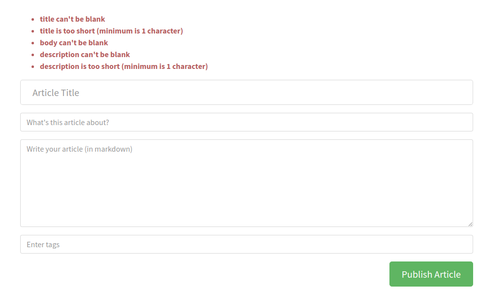

# Article Form

For for publishing a new article or edit an existing.

## Responsibilities

### Basic

- Render article form

### Extra

- Preview markdown
- Autocomplete for tags

## Interfaces

```elm


type alias Labels =
    { title : String
    , description : String
    , body : String
    , tags : String
    , submitButton : String
    }


type alias Article =
    { slug : String
    , title : String
    , description : String
    , body : String
    , tags : List String
    }


type alias Problem =
    { key : String
    , problem : String
    }

type MsgIn
    = InitCreate
        { labels : Labels
        }
    | InitEdit --> ObserveArticle
        { labels : Labels
        , articleSlug : Slug
        }
    | RecvArticle Article
    | RecvProblems (List Problem)
    | RecvSuccess Article


type MsgOut
    = ObserveArticle Slug
    | FormCreateSubmitted
        { title : String
        , description : String
        , body : String
        , tags : List String
        }
    | FormUpdateSubmitted
        { slug : Slug
        , title : Maybe String
        , description : Maybe String
        , body : Maybe String
        , tags : Maybe (List String)
        }
    | CreateSuccess Slug
    | EditSuccess Slug

```

## Image


With error messages



## Template

```html
<div class="editor-page">
  <div class="container page">
    <div class="row">

      <div class="col-md-10 offset-md-1 col-xs-12">
        <form>
          <fieldset>
            <fieldset class="form-group">
                <input type="text" class="form-control form-control-lg" placeholder="Article Title">
            </fieldset>
            <fieldset class="form-group">
                <input type="text" class="form-control" placeholder="What's this article about?">
            </fieldset>
            <fieldset class="form-group">
                <textarea class="form-control" rows="8" placeholder="Write your article (in markdown)"></textarea>
            </fieldset>
            <fieldset class="form-group">
                <input type="text" class="form-control" placeholder="Enter tags"><div class="tag-list"></div>
            </fieldset>
            <button class="btn btn-lg pull-xs-right btn-primary" type="button">
                Publish Article
            </button>
          </fieldset>
        </form>
      </div>

    </div>
  </div>
</div>
```
