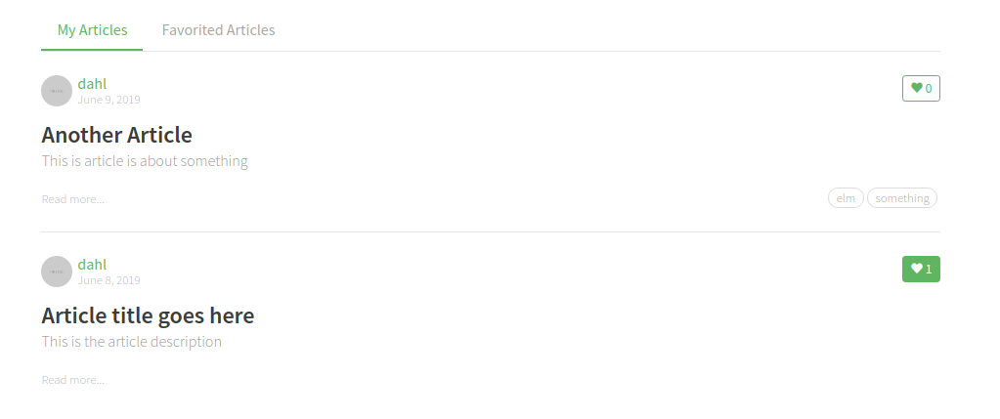
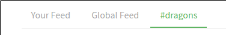
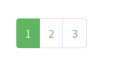

# Article List

Used on home page and profile page.

## Responsibilities

### Basic

- Show a list of articles
- Username links to user profile page
- Article title and read more links to article page
- Tabs to switch feed
- Extra tabs (for tags) can be added and removed.
- Pagination

### Extra

- Transition when tabs are switched.

## Interfaces

`feed` and `route` are parametric types. This avoids cupling this UI component
with a specific backend implementation.
This also simplifies testing.

```elm

import Time
import Data.Article.Tag exposing (Tag)
import Data.Article.Slug exposing (Slug)
import Data.Profile.Username exposing (Username)
import Data.Href exposing (Href)


{-| Compile time configuration (dependecy injection)
-}
type alias Config =
    { articleHref : Slug -> Href
    , profileHref : Username -> Href
    }


type alias Article =
    { title : String
    , description : String
    , createAt : Time.Posix
    , tags : List Tag
    , slug : Slug
    , favoritesCount : Int
    , favorited : Bool
    , authorName : Username
    , authorImage : String
    }


type alias Labels =
    { readMore : String
    }


type alias Tab feed =
    { feed : feed
    , label : String
    }


type MsgIn feed
    = GotLabels Labels
    | GotTabs (List (Tab feed))
    | AppendTab (Tab feed)
    | GotList
        { articles : List Article
        , feed : feed
        , total : Int
        , offset : Int
        }
    | ArticleWasChanged Article


type MsgOut feed
    = GiveMeFeedArticles
        { feed : feed
        , offset : Int
        , limit : Int
        }
    | FavoriteClicked Slug
    | TagClicked Tag

```

## Image



## Image, tags tab



## Image, pagination




## Template

### Tabs
```html
<div class="feed-toggle">
    <ul class="nav nav-pills outline-active">
        <li class="nav-item">
            <a class="nav-link disabled" href="">Your Feed</a>
        </li>
        <li class="nav-item">
            <a class="nav-link active" href="">Global Feed</a>
        </li>
    </ul>
</div>
```

### Article

```html
<div class="article-preview">
    <div class="article-meta">
        <a href="profile.html"></a>
        <div class="info">
            <a href="" class="author">Eric Simons</a>
            <span class="date">January 20th</span>
        </div>
        <button class="btn btn-outline-primary btn-sm pull-xs-right">
            <i class="ion-heart"></i> 29
        </button>
    </div>
    <a href="" class="preview-link">
        <h1>How to build webapps that scale</h1>
        <p>This is the description for the post.</p>
        <span>Read more...</span>
    </a>
</div>
```

### Pagination

```html
<ul class="pagination">
    <li class="page-item">
        <a class="page-link" href="">1</a>
    </li>
    <li class="page-item active">
        <a class="page-link" href="">2</a>
    </li>
    <li class="page-item">
        <a class="page-link" href="">3</a>
    </li>
</ul>
```
