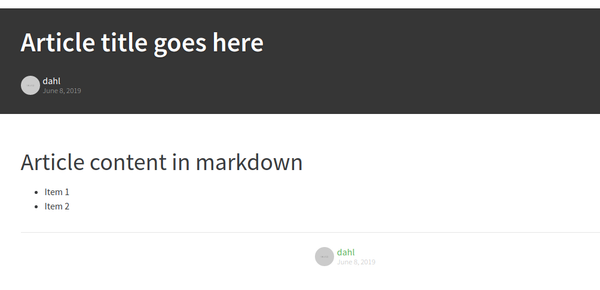
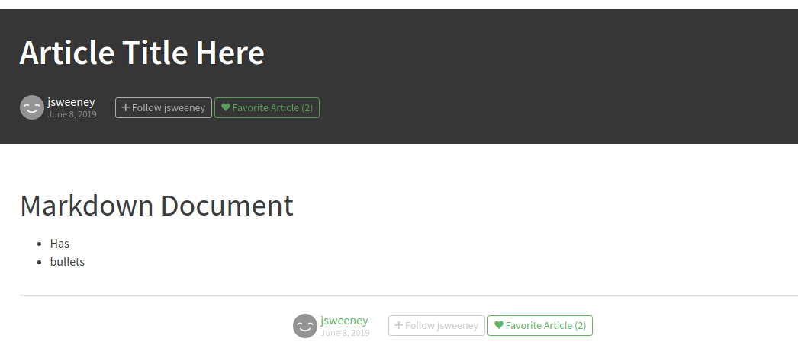
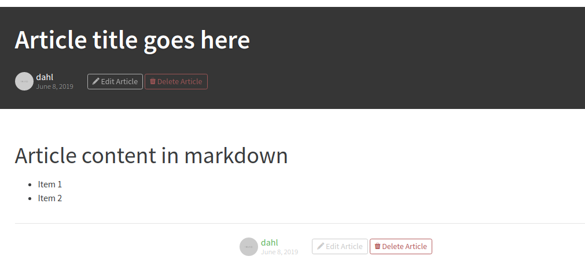

# Article View

View an article

## Responsibilities

- View Article
- Follow/Unfollow article author
- Favorite/Unfavorite article
- Edit/Delete your own article

Comments are not handled by this component. See [CommentView](CommentView.md)

## Interfaces

```elm

type alias Slug = String
type alias Username = String

type alias Labels =
    { editArticle : String
    , deleteArticle : String
    , follow : String
    , unfollow : String
    , favoriteArticle : String
    }


type alias Article =
    { title : String
    , slug : Slug
    , body : String
    , createdAt : Time.Posix
    , favoriteCount : Int
    , isFavorited : Bool
    , authorUsername : Username
    , authorImage : String
    , isFollowingAuthor : Bool
    }


type SessionStatus
    = LoggedOut
    | LoggedIn Username


type MsgIn
    = InitLabels Labels
    | ShowArticle Slug
    | RecvSession SessionStatus
    | RecvArticle Article
    | RecvError String


type MsgOut
    = ObserveArticle Slug
    | ObserveSession
    | Follow Username
    | UnFollow Username
    | Favorite Slug
    | UnFavorite Slug

```
## Image, guest view

If logged out you can't edit or delete.



## Image, logged in

When logged in and viewing some else's article




## Image, my own article

When logged in you can edit or delete your articles.



## Template

```html
<div class="banner">
    <div class="container">
        <h1>How to build webapps that scale</h1>
        <div class="article-meta">
            <a href=""></a>
            <div class="info">
                <a href="" class="author">Eric Simons</a>
                <span class="date">January 20th</span>
            </div>
            <button class="btn btn-sm btn-outline-secondary">
                <i class="ion-plus-round"></i>
                &nbsp;
                Follow Eric Simons <span class="counter">(10)</span>
            </button>
            &nbsp;&nbsp;
            <button class="btn btn-sm btn-outline-primary">
                <i class="ion-heart"></i>
                &nbsp;
                Favorite Post <span class="counter">(29)</span>
            </button>
        </div>
    </div>
</div>

<div class="container page">
    <div class="row article-content">
        <div class="col-md-12">
            <p>
            Web development technologies have evolved at an incredible clip over the past few years.
            </p>
            <h2 id="introducing-ionic">Introducing RealWorld.</h2>
            <p>It's a great solution for learning how other frameworks work.</p>
        </div>
    </div>

    <hr />

    <div class="article-actions">
        <div class="article-meta">
            <a href="profile.html"></a>
            <div class="info">
                <a href="" class="author">Eric Simons</a>
                <span class="date">January 20th</span>
            </div>

            <button class="btn btn-sm btn-outline-secondary">
                <i class="ion-plus-round"></i>
                &nbsp;
                Follow Eric Simons <span class="counter">(10)</span>
            </button>
            &nbsp;
            <button class="btn btn-sm btn-outline-primary">
                <i class="ion-heart"></i>
                &nbsp;
                Favorite Post <span class="counter">(29)</span>
            </button>
        </div>
    </div>
</div>
```
