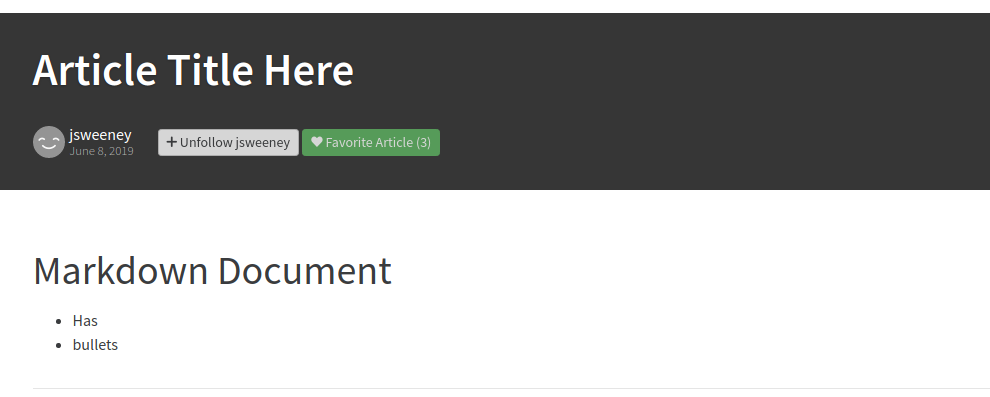

# Article View

View an article

## Responsibilities

- View Article
- Follow/Unfollow article author
- Favorite/Unfavorite article
- Edit/Delete your own article


## Interfaces

```elm

type alias Slug = String
type alias Username = String

type alias Article =
    { title : String
    , slug : Slug
    , body : String
    , createdAt : Time.Posix
    , favoriteCount : Int
    , isFavorited : Bool
    , authorUsername : Username
    , authorImage : String
    , isFollowingAuthor : Bool
    }


type SessionStatus
    = LoggedOut
    | LoggedIn Username


type MsgIn
    = ShowArticle Slug
    | RecvSession SessionStatus
    | RecvArticle Article
    | RecvError String


type MsgOut
    = ObserveArticle Slug
    | ObserveSession
    | Follow Username
    | UnFollow Username
    | Favorite Slug
    | UnFavorite Slug

```
## Image, guest view

If logged out you can't edit or delete.


## Image, logged in

When logged in and viewing some else's article




## Image, my own article

When logged in you can edit or delete your articles.


## Template

```html
```
