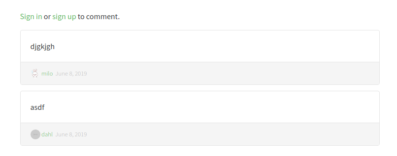
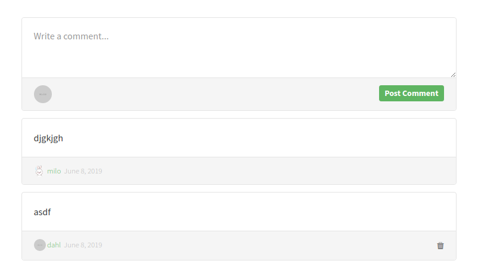

# Article Comment


## Responsibilities

- Display comments
- Create comment form if user is logged in

## Interfaces

```elm

import Data.Article.Slug exposing (Slug)
import Data.Profile.Username exposing (Username)
import Time


type alias Comment =
    { id : Int
    , title : String
    , body : String
    , createdAt : Time.Posix
    , authorUsername : Username
    , authorImage : String
    }


type SessionStatus
    = LoggedOut
    | LoggedIn Username


type alias Labels =
    { postComment : String
    , writeCommentPlaceholder : String
    , notLoggedInMessage : String
    }


type MsgIn
    = GotLabels Labels
    | ShowCommentsForArticle Slug
    | GotSession SessionStatus
    | GotComments (List Comment)
    | CommentWasCreated
        { clientId : Int
        , comment : Comment
        }
    | CommentCreateError
        { clientId : Int
        , error : String
        }
    | CommentWasDeleted
        { commentId : Int
        }
    | CommentDeleteError
        { commentId : Int
        , error : String
        }
    | GotError String


type MsgOut
    = ObserveArticleComments Slug
    | ObserveSession
    | SubmitComment
        { articleSlug : Slug
        , body : String
        , clientId : Int
        }
    | DeleteComment
        { articleSlug : Slug
        , commentId : Int
        }


```
## Image, guest view

If logged out you can only read comments



## Image, logged in view

If logged in you can post comments and delete your own comments.




## Template

```html
<div>
    <form class="card comment-form">
        <div class="card-block">
            <textarea class="form-control" placeholder="Write a comment..." rows="3"></textarea>
        </div>
        <div class="card-footer">
            
            <button class="btn btn-sm btn-primary">
                Post Comment
            </button>
        </div>
    </form>
    <div class="card">
        <div class="card-block">
            <p class="card-text">With supporting text below as a natural lead-in to additional content.</p>
        </div>
        <div class="card-footer">
            <a href="" class="comment-author">
                
            </a>
            &nbsp;
            <a href="" class="comment-author">Jacob Schmidt</a>
            <span class="date-posted">Dec 29th</span>
        </div>
    </div>

    <div class="card">
        <div class="card-block">
            <p class="card-text">With supporting text below as a natural lead-in to additional content.</p>
        </div>
        <div class="card-footer">
            <a href="" class="comment-author">
                
            </a>
            &nbsp;
            <a href="" class="comment-author">Jacob Schmidt</a>
            <span class="date-posted">Dec 29th</span>
            <span class="mod-options">
                <i class="ion-edit"></i>
                <i class="ion-trash-a"></i>
            </span>
        </div>
    </div>
</div>
```
