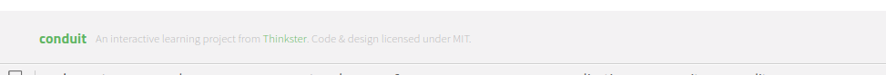

# Footer

Site footer.

## Responsibilities

- Render attribution from markdown.

## Interfaces

```elm

type alias Labels =
    { logo : String
    , attribution : String -- Markdown
    }

type MsgIn
    = InitLabels Labels


type MsgOut
    = NoOut

```

## Image



## Template

```html
<div class="container">
    <a href="/" class="logo-font">conduit</a>
    <span class="attribution">
        An interactive learning project from <a href="https://thinkster.io">Thinkster</a>. Code &amp; design licensed under MIT.
    </span>
</div>
```
