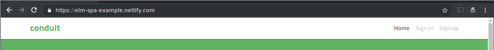
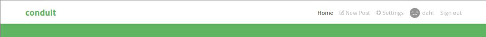

# Header

Site header.

## Responsibilities

- Render links
- Change menu when logged in / logged out

## Interfaces

Menu items will be set using the session event.

```elm

type alias Config route =
    { routeToHref : route -> String
    }


type alias MenuItem route =
    { title : String
    , route : route
    }


type MsgIn route
    = RouteChanged route
    | SetMenuItems (List MenuItem)


type MsgOut
    = ObserveRoute
    | ObserveSession

```

## Image

Header, logged out


Header, logged in


## Template

```html
<nav class="navbar navbar-light">
    <div class="container">
        <a class="navbar-brand" href="index.html">conduit</a>
        <ul class="nav navbar-nav pull-xs-right">
            <li class="nav-item">
                <!-- Add "active" class when you're on that page" -->
                <a class="nav-link active" href="">Home</a>
            </li>
            <li class="nav-item">
                <a class="nav-link" href="">
                    <i class="ion-compose"></i>&nbsp;New Post
                </a>
            </li>
            <li class="nav-item">
                <a class="nav-link" href="">
                    <i class="ion-gear-a"></i>&nbsp;Settings
                </a>
            </li>
            <li class="nav-item">
                <a class="nav-link" href="">Sign up</a>
            </li>
        </ul>
    </div>
</nav>
```
