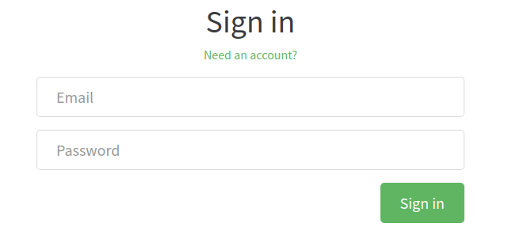
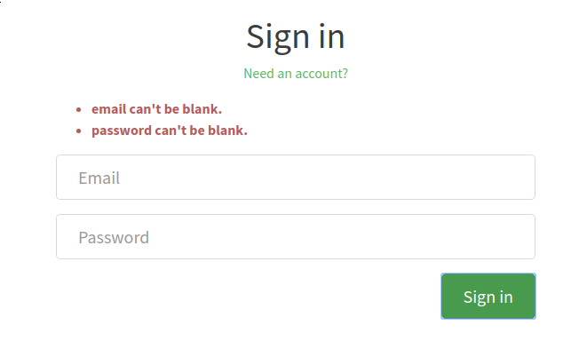

# Login Form

## Responsibilities

- Render login form inputs
- Display error messages

## Interfaces

```elm

type alias Problem =
    { key : String
    , problem : String
    }


type alias User =
    { username : String
    }


type alias Labels =
    { email : String
    , password : String
    , heading : String
    , needAnAccount : String
    , needAnAccountHref : String
    , submitButton : String
    }


type MsgIn
    = InitLabels Labels
    | RecvProblems (List Problem)
    | RecvLoginSuccess User


type MsgOut
    = FormWasSubmitted
        { email : String
        , password : String
        }
    | LoginWasSuccessfull User

```

## Image



## Image, with error message



## Template

```html

<div>
    <h1 class="text-xs-center">Sign up</h1>
    <p class="text-xs-center">
        <a href="">Have an account?</a>
    </p>

    <ul class="error-messages">
        <li>That email is already taken</li>
    </ul>

    <form>
        <fieldset class="form-group">
            <input class="form-control form-control-lg" type="text" placeholder="Your Name">
        </fieldset>
        <fieldset class="form-group">
            <input class="form-control form-control-lg" type="text" placeholder="Email">
        </fieldset>
        <fieldset class="form-group">
            <input class="form-control form-control-lg" type="password" placeholder="Password">
        </fieldset>
        <button class="btn btn-lg btn-primary pull-xs-right">Sign up</button>
    </form>
</div>

```
