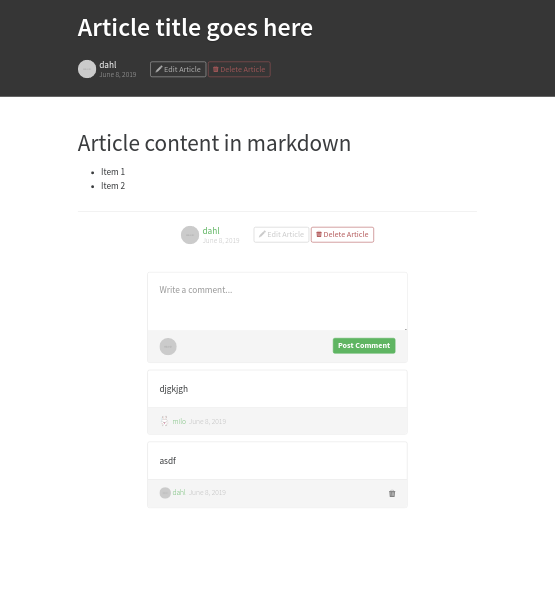

# Article Page Layout

The [page root] component only accepts one PID for
the content. This component builds the article page
by combining the [article view] and [comments] component.

## Responsibilities

- Layout [article view] and [comments] components.

## Interfaces

```elm

import Data.Article.Slug exposing (Slug)

type MsgIn
    = ShowArticle Slug
    | GotArticleProcess Slug PID
    | GotCommentProcess Slug PID


type MsgOut
    = SpawnArticle Slug --> Expects GotArticleProcess
    | SpawnComments Slug --> Expects GotCommentProcess

```

## Image




[article view]: ArticleView.md
[comments]: CommentView.md
[page root]: PageRoot.md
