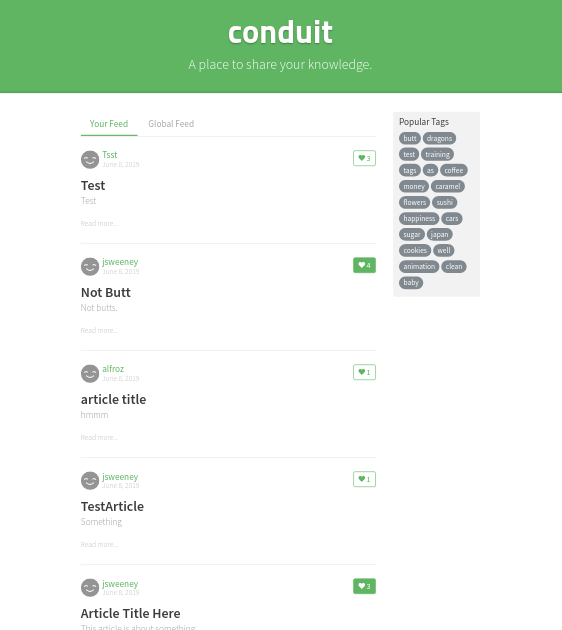

# Home Page Layout

The [page root] component only accepts one PID for
the content. This component builds the home page
by combining the [feed] and [tag] component.

## Responsibilities

- Render green "conduit" hero
- Layout [feed] and [tag] components in two columns

## Interfaces

```elm

type alias Labels =
    { logo : String
    , tagline : String
    }


type MsgIn
    = InitLabels Labels
    | GotFeed PID
    | GotTags PID


type MsgOut
    = SpawnFeed
    | SpawnTags

```

## Image




[feed]: ArticleList.md
[tag]: Tags.md
[page root]: PageRoot.md
