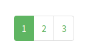

# Pagination

## Responsibilities

- Render pagination links

## Interfaces

```elm

type alias Config route =
    { routeForPage : Int -> route
    , routeToHref : route -> String
    }


type MsgIn
    = SetTotalPages Int
    | SetCurrentPage Int


type MsgOut
    = NoOut

```

## Image




## Template

```html
<ul class="pagination">
    <li class="page-item">
        <a class="page-link" href="">1</a>
    </li>
    <li class="page-item active">
        <a class="page-link" href="">2</a>
    </li>
    <li class="page-item">
        <a class="page-link" href="">3</a>
    </li>
</ul>
```
