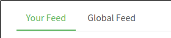

# Tabs

## Responsibilities

### Basic

- Render tabs
- When a tab is clicked, send an out msg with tab id

### Extra

- If tabs does not fit, show scrolling arrows.

## Interfaces

```elm

type alias Tab id
    { id : id
    , title : String
    }


type MsgIn id
    = SetTabs (List (Tab id))
    | AppendExtraTab (Tab id)
    | RemoveExtraTabs
    | SetActive id


type MsgOut id
    = TabSelected id

```

## Image



## Template

```html
<div class="feed-toggle">
    <ul class="nav nav-pills outline-active">
        <li class="nav-item">
            <a class="nav-link disabled" href="">Your Feed</a>
        </li>
        <li class="nav-item">
            <a class="nav-link active" href="">Global Feed</a>
        </li>
    </ul>
</div>
```
