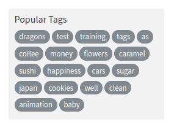

# Tags

A "tag cloud" component.

## Responsibilities

### Basic

- Render tags
- When a tag is clicked, send an out msg
- Display an error message if something went wrong.

### Extra

- When a tag is clicked it should flash to give user feedback.
- When a loding error occur the component should display a retry button.

## Interfaces

```elm

import Data.Article.Tag exposing (Tag)


type alias Labels =
    { title : String
    }


type MsgIn
    = GotLabels Labels
    | GotTags (List Tag)
    | GotError String


type MsgOut
    = TagClicked Tag
    | GiveMeTags

```

## Image



## Template

```html
<div>
    <p>Popular Tags</p>
    <div class="tag-list">
        <a href="" class="tag-pill tag-default">programming</a>
        <a href="" class="tag-pill tag-default">javascript</a>
        <a href="" class="tag-pill tag-default">emberjs</a>
        <a href="" class="tag-pill tag-default">angularjs</a>
        <a href="" class="tag-pill tag-default">react</a>
        <a href="" class="tag-pill tag-default">mean</a>
        <a href="" class="tag-pill tag-default">node</a>
        <a href="" class="tag-pill tag-default">rails</a>
    </div>
</div>
```
