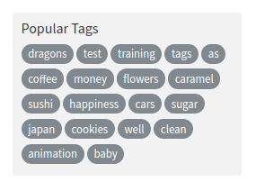

# Tags

## Responsibilities

- Fetch and Render tags
- When a tag is clicked, send an out msg

## Interfaces

```elm

type alias Config =
    { loadTags : (Result String (List Tag) -> msg) -> Cmd msg
    }


type alias Tag =
    String


type alias Props =
    { title : String
    }


type MsgIn
    = Init Props
    | RecvTagList (List String)


type MsgOut
    = TagClicked String

```

## Image



## Template

```html
<div>
    <p>Popular Tags</p>
    <div class="tag-list">
        <a href="" class="tag-pill tag-default">programming</a>
        <a href="" class="tag-pill tag-default">javascript</a>
        <a href="" class="tag-pill tag-default">emberjs</a>
        <a href="" class="tag-pill tag-default">angularjs</a>
        <a href="" class="tag-pill tag-default">react</a>
        <a href="" class="tag-pill tag-default">mean</a>
        <a href="" class="tag-pill tag-default">node</a>
        <a href="" class="tag-pill tag-default">rails</a>
    </div>
</div>
```
