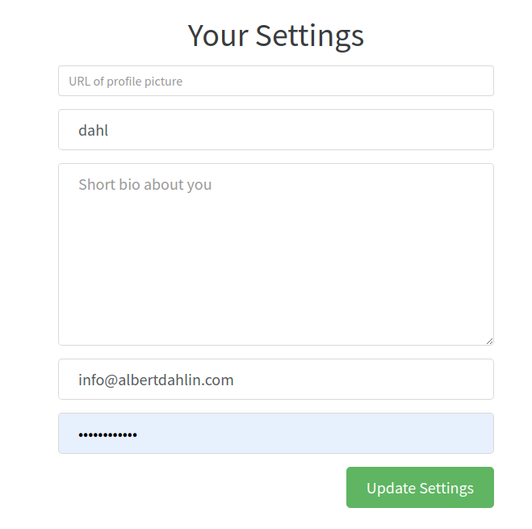

# User edit Form

## Responsibilities

- Render user edit form
- Display error messages

## Interfaces

```elm

type alias Problem =
    { key : String
    , problem : String
    }


type alias Username = String

type alias User =
    { username : Username
    , image : String
    , bio : String
    , email : String
    }


type MsgIn
    = InitLabels
        { heading : String
        , username : String
        , image : String
        , bio : String
        , email : String
        , password : String
        , submit : String
        }
    | EditUser Username
    | RecvUser User
    | RecvProblems (List Problem)
    | RecvSuccess User


type MsgOut
    = ObserveUser Username
    | FormWasSubmitted
        { username : Maybe String
        , image : Maybe String
        , bio : Maybe String
        , email : Maybe String
        , password : Maybe String
        }
    | SaveWasSuccessfull User

```

## Image




## Template

```html

<h1 class="text-xs-center">Your Settings</h1>

<form>
  <fieldset>
      <fieldset class="form-group">
        <input class="form-control" type="text" placeholder="URL of profile picture">
      </fieldset>
      <fieldset class="form-group">
        <input class="form-control form-control-lg" type="text" placeholder="Your Name">
      </fieldset>
      <fieldset class="form-group">
        <textarea class="form-control form-control-lg" rows="8" placeholder="Short bio about you"></textarea>
      </fieldset>
      <fieldset class="form-group">
        <input class="form-control form-control-lg" type="text" placeholder="Email">
      </fieldset>
      <fieldset class="form-group">
        <input class="form-control form-control-lg" type="password" placeholder="Password">
      </fieldset>
      <button class="btn btn-lg btn-primary pull-xs-right">
        Update Settings
      </button>
  </fieldset>
</form>
```
